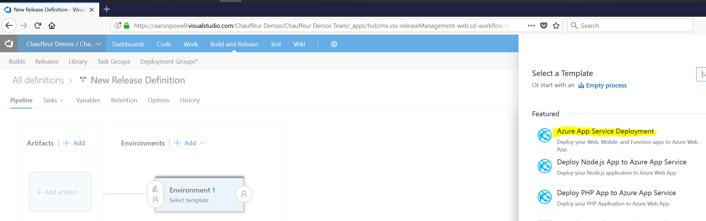
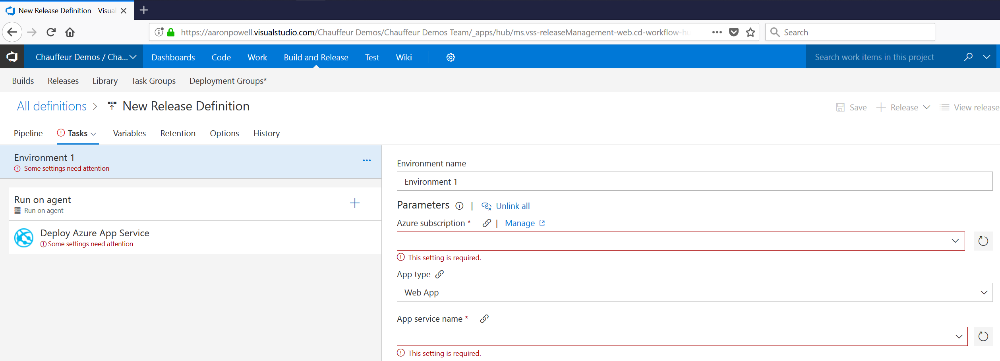
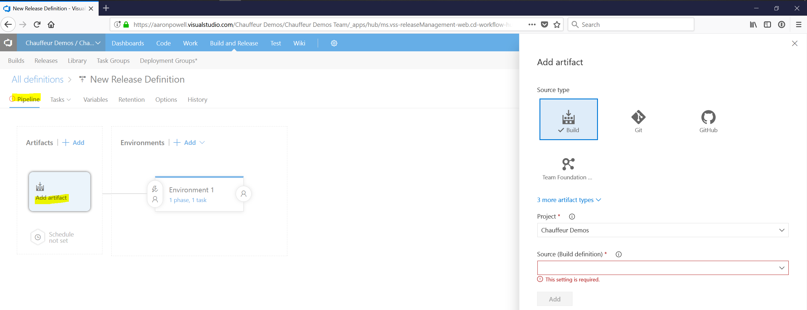
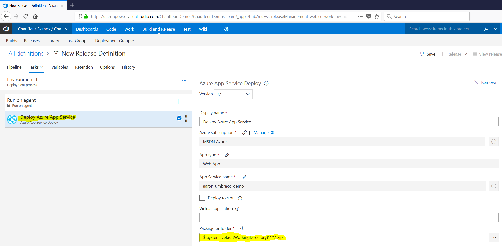
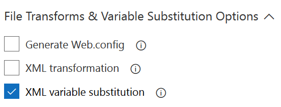
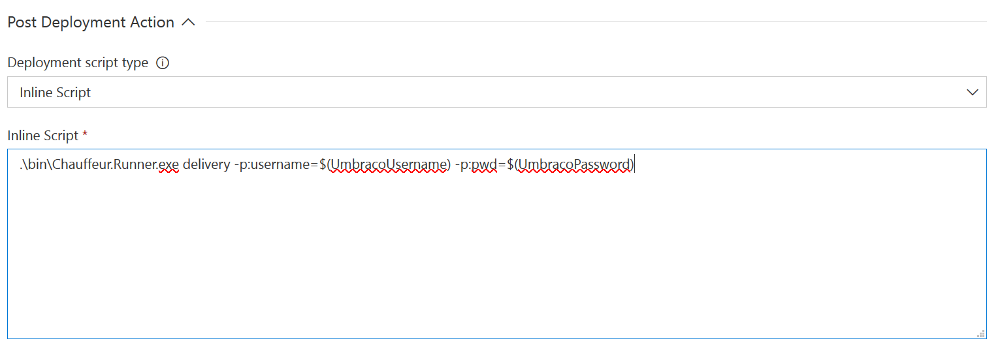
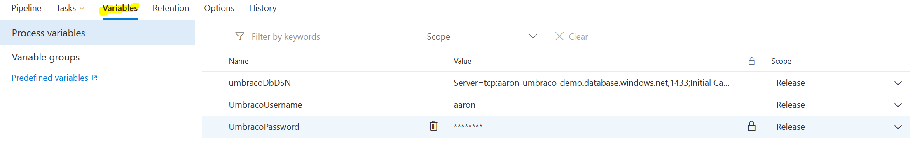
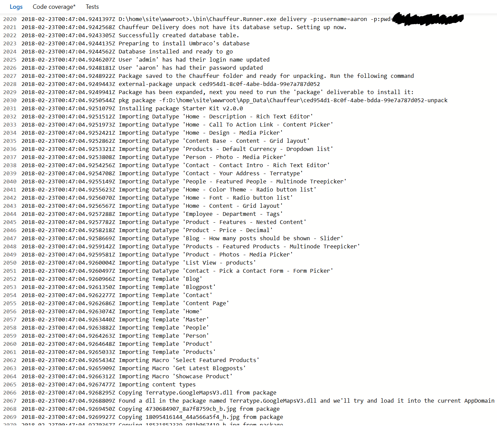

When you're using [Visual Studio Team Services, aka VSTS](https://www.visualstudio.com/team-services/) to build Umbraco projects it's really easy to then deploy those into an [Azure AppService](https://azure.microsoft.com/en-us/services/app-service/).

This guide will help you configure the Release pipeline to use Chauffeur in your Umbraco deployment.

_For brevity I'm going to only configure a single environment, but in reality you probably want more than one :wink:_

## Prerequisites

1. You have an existing VSTS account
2. You have an Azure account and setup an AppService + SQL Database
3. You are building your project using VSTS Build

## Getting Started

Start by creating a new Release Definition and selecting the `Azure App Service Deployment` template (it'll speed everything up!)



Set the Azure connection information (your Subscription and AppService to deploy into)



Click on the `Pipeline` tab and then add a linked artifact. This should be linked to your VSTS Build definition.



Go back to the `Deploy Azure App Service` task and ensure the `Package or folder` property is mapping through to the build artifact correctly.



Expand the `File Transforms & Variable Substitution Options` properties and check `XML variable substitution`.



Expand the `Post Deployment Action` properties and select `Inline Script` and enter the path to `Chauffeur.Runner.exe`, which will be in your application's `bin` folder and have it run the `delivery` deliverable. You're probably going to enter something like this:

```
.\bin\Chauffeur.Runner.exe delivery
```

You can also pass in any parameters you want to the runner to act as variable substitution. In this example we're using two VSTS variables, one for Umbraco admin username, one for the Umbraco admin password.



Click on the `Variables` tab and create a variable called `umbracoDbDSN`. This will be replaced in the `web.config` before deploying into the Azure AppService. You should also create any variables you might want to pass to Chauffeur.



Once saved you're good to go, you should see something like the following in you VSTS logs.



And there you do it, you're good to go with deploying your site with Chauffeur into Azure from VSTS. Just repeat the above process for each of the environments you're wanting to target.

## Notes

A couple of things to note about this process:

**You have to do a XML variable substitution to set the connection string.**

If you're using an Azure AppService you might prefer to set the connection string directly in there. At this point in time that causes a problem in Chauffeur because Chauffer expects the connection string to be in the `web.config`. When you set it in the Azure AppService Azure runs some code on startup that uses reflection to override the `web.config` connection string.

**Chauffeur runs directly on Azure, not in VSTS.**

When the task executes the `Post Deployment Action` this is actually running on the Azure AppService you've deployed to, not on your VSTS agent, so anything you need must also be copied to Azure, that includes the `*.delivery` files or any external pieces for custom Deliverables.

You're also quite unprivileged as a user account, so again, be careful of your custom Deliverables.
